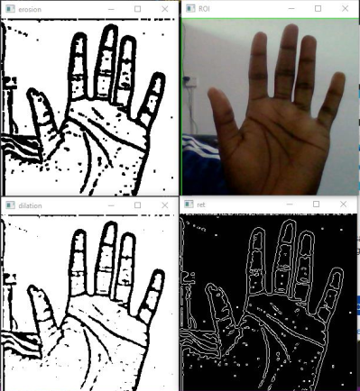
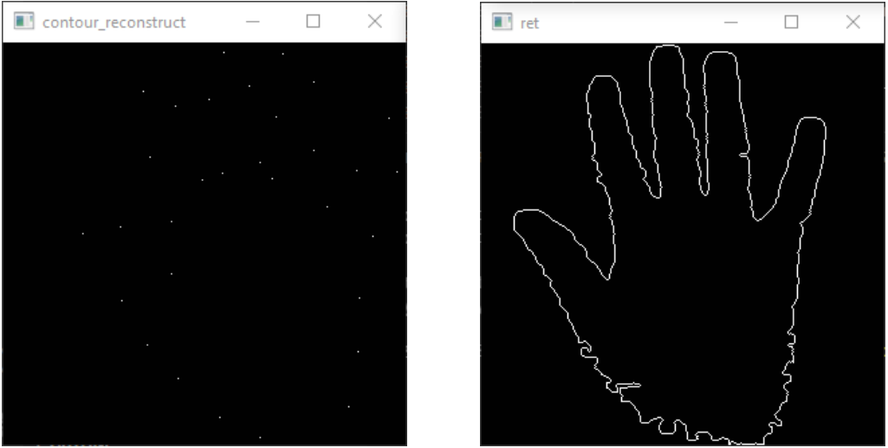

# Digital Image Processing: *Hand Segmentation*

# Design Requirements
Given a video stream with a hand in it, the real time video is read, and perform detection and segmentation of the hand. The program contains the threshold algorithm for segmentation, thresholding by hue features.

# Design Parameter
1. Read the video frame, transform to HIS space.

1. Build the training images, and generate the threshold of hue features of hand. 

1. For the test image, doing the threshold segmentation.
1. Perform the morphological operation, median filter to make the result better.
1. the original video and the segmentation result are displayed simultaneously.

# Design Content
Using python language, realize a hand segmentation. The hand segmentation can be done using threshold segmentation for image test and median filter in the morphology operation to make the result better. Simultaneously reading the video frame, transform to HIS space displaying the segmentation result.

# Output
## Detection and Segmentation

## Contour reconstruction
